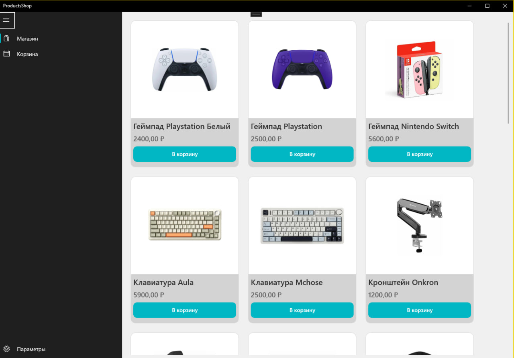
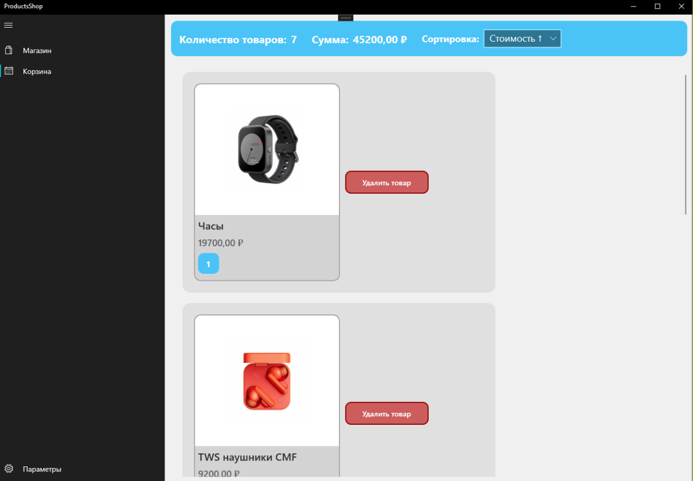

  <h1>UWP Products shop</h1>

Это простое UWP приложение магазина вещей с страницей товаров и корзиной.

### Навигационное меню - MainPage
Навигационное меню для перехода между вкладками. По умолчанию отображается ShopPage

### Страница магазина - ShopPage
Страница с товарами, отображённых в виде сетки карточек. Каждая карточка содержит изображение товара, название и его цену в рублях.
Товар можно добавить в корзину, нажав на соответствующую кнопку.

> [!NOTE]
> Товары подгружаются через JSON файл и отображаются пользователю

### Корзина - CartPage
Корзина состоит из шапки и списка товаров добавленных пользователем.
В шапке находится количество товаров и их общая сумма. Также товары в корзине можно сортировать:
- По названию;
- По цене (возрастание);
- По цене (убывание)

Корзина и сортировка сохраняются при выходе из приложения и подгружаются через JSON файл при запуске.

